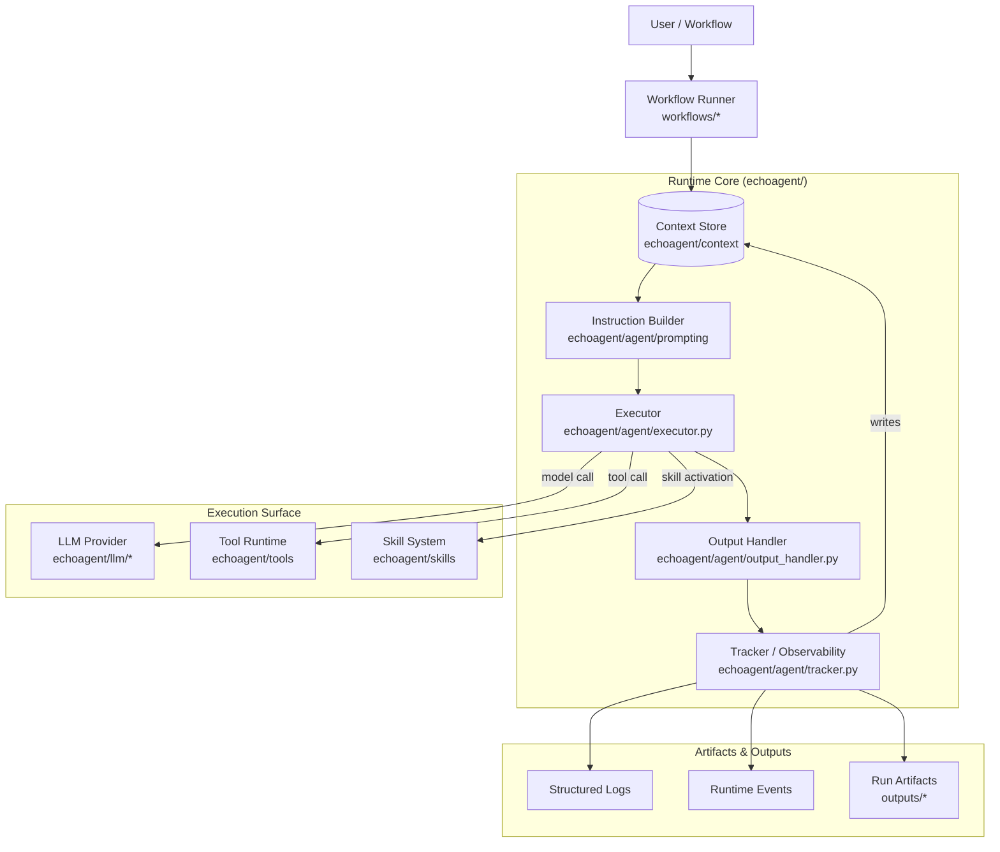

# EchoAgent

> 🧠 **Context-First Agent Runtime for Building Inspectable AI Systems**

EchoAgent is an **engineering-oriented agent framework** that treats **context as a first-class runtime artifact**.
Instead of hiding reasoning inside opaque prompt chains, EchoAgent exposes execution as a **structured, observable, and reproducible process**.

It is designed for developers who want to **understand, debug, and evolve** intelligent agents — not just run them.

---

## ✨ Why EchoAgent?

Most agent frameworks focus on *getting something to work*.

EchoAgent focuses on **making it understandable, controllable, and evolvable**.

| Traditional Agents | EchoAgent             |
| ------------------ | --------------------- |
| Prompt-centric     | Context-centric       |
| Implicit state     | Explicit state        |
| Hard to debug      | Fully observable      |
| Ad-hoc tools       | Protocolized skills   |
| One-off flows      | Reproducible runtimes |

---

## 🚀 Quick Start

### 1️⃣ Install

```bash
git clone https://github.com/JoelEmbiiddddd/EchoAgent.git
cd EchoAgent
cp .env.example .env
```

### 2️⃣ Configure

```env
OPENAI_API_KEY=your_key
OPENAI_MODEL=gpt-4.1
```

### 3️⃣ Run a workflow

```bash
python examples/web_researcher.py
```

You will see:

* structured logs
* step-by-step execution
* artifacts generated under `outputs/`

> 💡 Tip: Every run is inspectable and replayable.

---

## 🧠 Core Idea

EchoAgent treats an agent run as a **runtime system**, not a prompt.

At its core:

> **Context is the source of truth.**
> All execution reads from it and writes back to it.

This makes behavior:

* inspectable
* debuggable
* reproducible
* extensible

---

## 🏗 Architecture Overview



---

## 🧩 Core Concepts

### Context

Context is the shared, mutable state of a run:

* conversation history
* intermediate reasoning
* tool / skill results
* errors & metadata

All runtime stages **read from and write to Context**.

---

### Agent Runtime

An EchoAgent run is a **phased pipeline**:

1. Instruction building
2. Execution (LLM / Tool / Skill)
3. Output parsing & validation
4. Tracking & artifact generation
5. Iteration control

Each phase is explicit and observable.

---

### Tools vs Skills

| Concept | Purpose              | Properties                        |
| ------- | -------------------- | --------------------------------- |
| Tool    | Low-level capability | Stateless, direct execution       |
| Skill   | Agent behavior       | Declarative, contextual, governed |

Skills can:

* restrict tool usage
* override models
* disable LLM calls
* encapsulate reusable logic

---

## 🧩 Skill Definition (Example)

```markdown
---
name: web-research-summarize
description: Research a topic and summarize findings.
tags: [web, research]
allowed_tools: [web.search, web.crawl]
model_override: gpt-4.1
---

# Instructions
You are a research assistant...
```

Skills are **documents**, not functions — enabling discovery, routing, and governance.

---

## 🔍 Observability & Debugging

EchoAgent records:

* structured runtime events
* grouped logs by phase
* explicit error blocks
* persistent artifacts

This enables:

* replay & inspection
* regression testing
* UI visualization
* behavior comparison

---

## 📦 Repository Structure

```
EchoAgent/
├── echoagent/
│   ├── agent/        # runtime orchestration
│   ├── context/      # shared state & blocks
│   ├── tools/        # tool registry & execution
│   ├── skills/       # skill definitions
│   ├── llm/          # model providers
│   └── mcp/          # MCP integration
│
├── workflows/        # opinionated pipelines
├── examples/         # runnable demos
├── frontend/         # optional UI
├── outputs/          # runtime artifacts (gitignored)
└── tests/
```

---

## 🧭 Roadmap

### Near-term

* Improved skill routing
* Iteration-aware frontend
* Run replay tooling

### Mid-term

* Multi-agent orchestration
* Capability sandboxing
* Structured telemetry export

### Long-term

* Standardized skill protocols
* Pluggable memory backends
* Production hardening

---

## 🤝 Contributing

Contributions are welcome.

Guidelines:

1. Change one runtime boundary at a time
2. Add or update a workflow as validation
3. Keep behavior observable

---

## 📄 License

Provided under the repository license.

